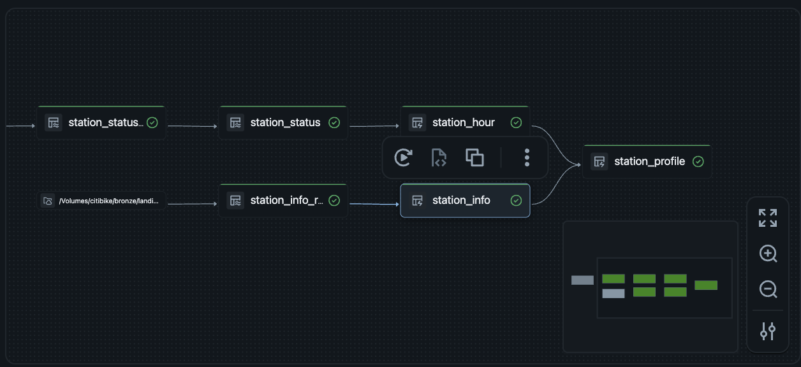

# Empty Dock: NYC Bike-Share Availability Analytics

An end-to-end data pipeline on **Databricks** that ingests live Citi Bike station data every 15 minutes, models it through a **bronze → silver → gold medallion architecture**, and answers one question:

> **Which NYC bike stations run out of bikes or docks, when, and why?**

**[▶ View the interactive charts](https://ree3278.github.io/empty_dock/)** · [Dashboard screenshot](../docs/dashboard_graph.png)


---

## Highlights

- **Live ingestion** from Citi Bike's public GBFS API on a 15-minute schedule
- **Incremental loading** with Auto Loader, so each run processes only new files
- **[TODO: e.g. 1.2M+] station snapshots** across **2,500+ stations**
- **Data-quality expectations** that caught a silent parsing bug misclassifying **79 stations**
- **Station segmentation** into commute patterns (residential, job center, chronically empty/full)
- **Interactive visuals**: animated hourly map, station-type map, city pulse chart, daily swing heatmap

## Tech stack

| Layer | Tools |
|---|---|
| Ingestion | Python (`requests`), Databricks Jobs |
| Storage | Delta Lake, Unity Catalog Volumes |
| Transformation | Lakeflow Declarative Pipelines, Auto Loader, SQL |
| Data quality | Pipeline expectations (warn / drop / fail) |
| Visualization | Plotly, Databricks AI/BI dashboard, GitHub Pages |

---

## Architecture



```
Citi Bike GBFS API
   │  every 15 min (Databricks Job)
   ▼
Landing Volume (raw JSON)
   │  Auto Loader, incremental
   ▼
BRONZE   station_status_raw, station_info_raw      raw payload + file lineage
   ▼
SILVER   station_status, station_info              one row per station per snapshot, typed + validated
   ▼
GOLD     station_hour, station_profile             hourly metrics + station segmentation
   ▼
AI/BI dashboard  ·  Plotly HTML exports
```

### Data sources

| Feed | Contents | Cadence |
|---|---|---|
| `station_status.json` | Bikes, e-bikes and docks available; operating flags | Every 15 min |
| `station_information.json` | Name, coordinates, capacity | On demand (rarely changes) |

Both are public [GBFS](https://gbfs.org/) feeds published by Citi Bike.

---

## How the pipeline works

### Bronze: land it as-is
Auto Loader reads new JSON files from the landing Volume and appends them to streaming tables. Each row keeps the raw payload plus `source_file` and `ingested_at`, so any record can be traced back to the file it came from. Bronze is never cleaned, so silver can always be rebuilt from it.

### Silver: clean and validate
- Explodes each snapshot's nested station list into **one row per station per snapshot**
- Applies an explicit schema with `from_json` (schema-on-read)
- Converts Unix timestamps; casts counts and flags to proper types
- Derives `is_empty`, `is_full` and `is_operational`
- `station_info` is a materialized view keeping the latest record per station

**Expectations:**

| Rule | Action |
|---|---|
| `station_id IS NOT NULL` | Drop row |
| Bike and dock counts ≥ 0 | Drop row |
| Coordinates inside NYC | Drop row |
| Operating flags parsed (not null) | Warn |
| Report less than 1 day old | Warn |
| Capacity > 0 | Warn |

### Gold: answer questions
- **`station_hour`**: per station, per NYC-local hour: average bikes and docks, % of time empty and full (counted only while the station is operating)
- **`station_profile`**: classifies each station by its commute behavior:

| Type | Pattern |
|---|---|
| Residential | Drains in the morning, fills in the evening |
| Job center | Fills in the morning, drains in the evening |
| Chronically empty / full | Problem all day |
| Balanced | Neither |
| Out of service | Not operating, or zero capacity |

### Orchestration
One Databricks Job chains **poll API → run pipeline**. The pipeline resolves table dependencies automatically, so bronze, silver and gold always refresh in the right order.

---

## Data-quality story: the 79 "always empty" stations

The first version of the heatmap showed 79 stations empty **100% of the time**. Investigating them revealed two separate issues:

1. **Silent nulls.** Citi Bike sends `is_renting` and `is_returning` as `1`/`0`, but silver parsed them as booleans, so every value became `NULL` with no error. Closed stations were indistinguishable from drained ones.
2. **Zero-capacity stations** were "empty" by definition.

**Fix:**
- Parsed the flags as integers and derived booleans explicitly
- Rebuilt silver from bronze with a full refresh (no data re-fetched, which is the point of keeping a raw layer)
- Counted empty/full time **only while a station is operating**
- Added
